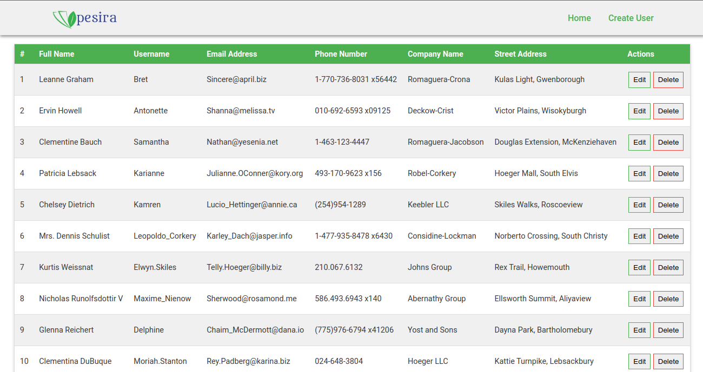
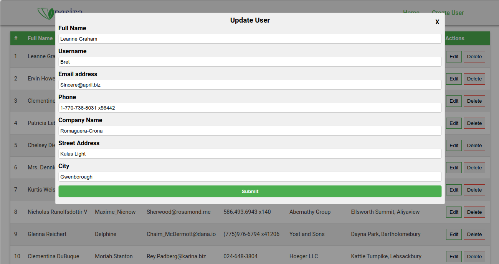
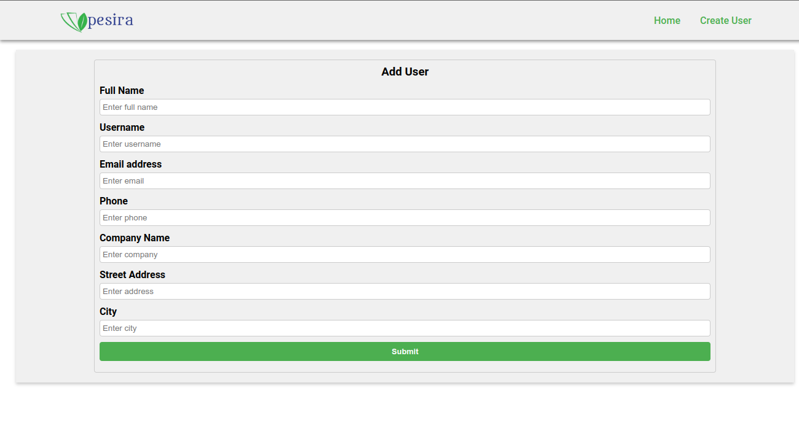
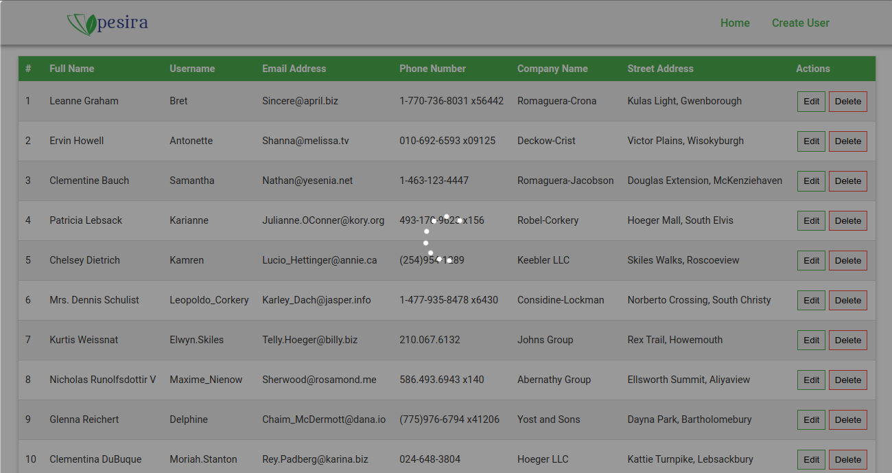
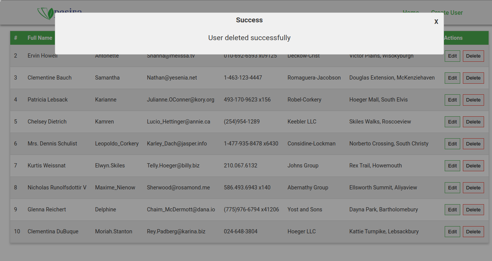
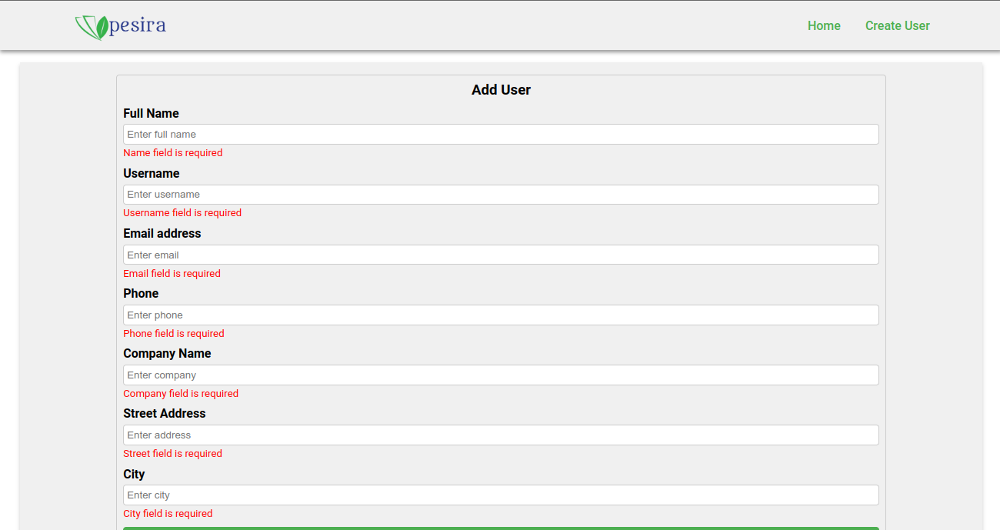

# Pesira User Management App

A React.js take-home app project to demonstrate understanding of the library

## Installation

Follow the steps below to install and run the application:

## Step 1: Install Node.js and npm

1. Make sure you have Node.js and npm (Node Package Manager) installed on your machine. You can download them from the [Official Node.js website](https://nodejs.org/en/).

2. Follow the installation instructions specific to your operating system.

## Step 2: Clone the repository

1. Open a terminal or command prompt.

2. Navigate to the directory where you want to clone the "pesira_user_manager" repository.

3. Run the following command to clone the repository:

    ```bash
    git clone git@github.com:karianmash/pesira_user_manager.git
    ```

## Step 3: Install project dependencies

1. Change into the project directory:

    ```bash
    cd pesira_user_manager
    ```

2. Run the following command to install the project dependencies:

    ```bash
    npm install
    ```

    This command will read the "package.json" file and install all the necessary packages listed in it.

## Step 4: Start the development server

1. Run the following command to start the development server:

    ```bash
    npm start
    ```

    This command will start the development server and open the application in your default browser. You should see an output similar to:

        You can now view pesira_user_manager in the browser.

        Local:            http://localhost:3000
        On Your Network:  http://192.168.100.15:3000

        Note that the development build is not optimized.
        To create a production build, use npm run build.

        webpack compiled successfully

2. Open your web browser and visit [http://localhost:3000](http://localhost:3000) to see the running "pesira_user_manager" app.

## Application Features

The application has the following features:

1. A user can view a list of users.

[](public/images/home.png)

2. A user can view a user's details.

[](public/images/edit-user.png)

3. A user can edit a user's details.

[](public/images/edit-user.png)

4. A user can delete a user.

5. A user can add a new user.

[](public/images/add-user.png)

6. The applications includes a loader indicator to show when data is being fetched from the server.

[](public/images/loader.png)

7. Response messages are displayed to the user when an action is performed.

[](public/images/response-message.png)

8. There's validation of form input fields.

[](public/images/validation.png)

## Project Structure

The project structure is as follows:

```bash
pesira_user_manager
├── public
│   ├── images
│   │   └── ...
│   ├── favicon.jpg
│   ├── index.html
│   └── manifest.json
├── src
│   ├── components
│   │   ├── AddUserForm
│   │   │   ├── AddUserForm.js
│   │   ├── Header
│   │   │   ├── Header.js
│   │   │   ├── ...
│   │   ├── Modals
│   │   │   ├── Loader
│   │   │   │   ├── Loader.js
│   │   │   │   ├── ...
│   │   │   ├── ResponseMessage
│   │   │   │   ├── ResponseMessage.js
│   │   │   │   ├── ...
│   │   │   ├── ...
│   │   ├── Table
│   │   │   ├── Table.js
│   │   │   ├── ...
│   ├── pages
│   │   ├── AddUser
│   │   │   ├── AddUser.js
│   │   ├── Home
│   │   │   ├── Home.js
│   │   │   ├── ...
│   │   └── ...
```

## License

Distributed under the MIT License. See `LICENSE` for more information.
